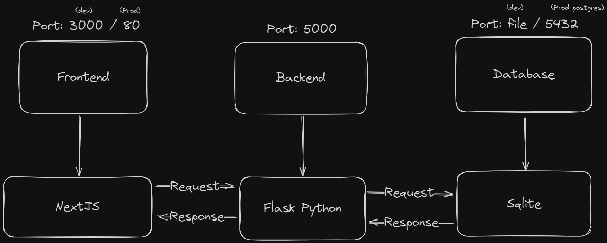

# Webtechnologie opdracht: Thinkr.

## Inhoudsopgave

1. Introductie
   1. Leerdoelen
   2. De backend
   3. De frontend
   4. Weergave van de infrastructuur
2. Werkmethode
   1. Design
   2. Git(hub)
   3. Werkomgeving
3. Features bij inlevering project.
   1. Account aanmaken ✅
   2. Profiel aanmaken ✅
   3. Inloggen ✅
   4. Post aanmaken ✅
   5. Post verwijderen ❌
   6. Accounts weergeven ✅
   7. Andere gebruiker volgen ✅
   8. Uitloggen ❌
4. Features voor later
   1. Posts liken ❌
   2. Comments plaatsen ❌
   3. Posts reposten ❌
   4. Zoekfunctie ❌
   5. Profiel aanpassen ❌
   6. Post bekijken ❌

## Introductie

### Leerdoelen

Voor ons eindonderdeel hebben we gekozen om een social media applicatie te maken. Onze leerdoelen zijn daarmee om 1: Om te gaan met het python framework `Flask`. En 2: Vormgeving leren te doen met `React`.

### De backend

De backend wordt geschreven in `Flask`, die zet meerdere endpoints open om vervolgens verschillende resources op te vragen van de `sqlite` database. Dit backend zal echter ook authenticatie en authorisatie regelen.

### De frontend

De frontend wordt geschreven in `NextJS` en als CSS framework wordt er gebruik gemaakt van `TailwindCSS`.

### Simpele weergave van de infrastructuur

## Werkmethode

### Design

Dit project wordt ontworpen in `Figma`<!-- balls -->. Een interactieve ontwerp tool die het samenwerkings process gemakkelijk maakt.

### Git

Voor dit project is er een Git repo aangemaakt waar in verschillende branches gewerkt wordt. Na code-review kan je pull request pas worden opgenomen in de main branch.

### Werkomgeving

Voor dit project gebruiken we Visual studio code als werkomgeving. Met een aantal extensions namelijk: `Python`, `Prettier`, `TailwindCSS` en `ESLint`.

<!-- link naar figma file [link](https://www.figma.com/file/3Sn2Edgmplv00aPOTISWDW/Thinkr-Design?type=design&node-id=0%3A1&mode=design&t=5x8MLYAifqjnASd2-1) -->

## Features bij inlevering project.

### Account aanmaken

Bij inlevering van het project hoort een gebruiker een account aan te kunnen maken met deze gegevens: `Email`, `Password`, `Username`.

### Profiel aanmaken

Bij inlevering van het project moet een gemaakt account een profiel te kunnen aanmaken met deze gegevens: `Display name`, `Bio`.

### Inloggen

Bij inlevereing van het project hoort een gebruiker in te kunnen loggen met deze gegevens: `Email`, `Password`

### Post aanmaken

Bij inlevering van het project moet een gebruiker die ingelogd is posts kunnen aanmaken.

### Accounts weergeven

Bij inlevering van het project moet een ingelogde gebruiker zijn of iemand anders account kunnen weergeven.

### Andere gebruiker volgen

Bij inlevering van het project moet een gebruiker die ingelogd is een andere gebruiker kunnen volgen. Dit gaat via de account weergave.

### Uitloggen

Bij inlevering van het project behoort een ingelogde gebruiker uit te kunnen loggen.

## 4 Features voor later

1.  Posts liken
2.  Comments plaatsen
3.  Posts reposten
4.  Zoekfunctie
5.  Profiel aanpassen
6.  Post bekijken
